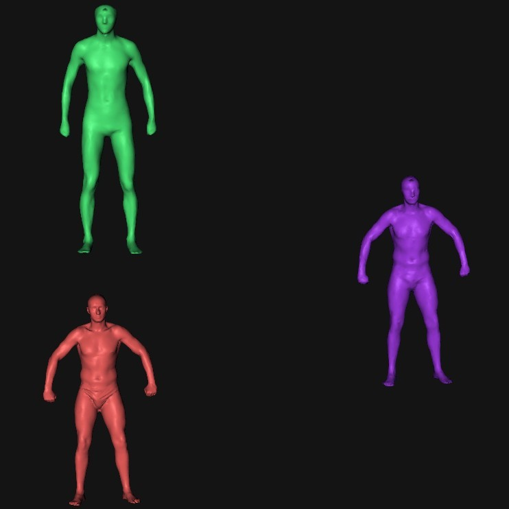
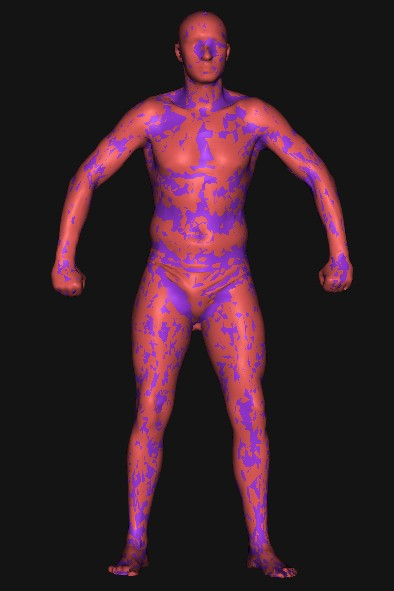
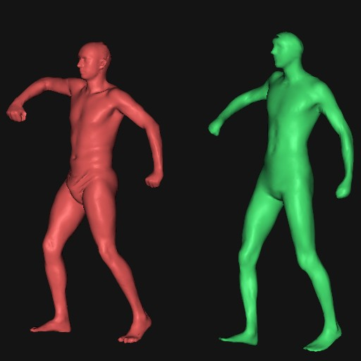

DeformationTransfer
===================

A very simple implement for the first step of deformation transfer that might be
used in my later reconstruction work. The result can be shown below.

Firstly, the input is two different mesh (namely source mesh and target mesh),
the result using the algorithms is to deform the first/upper mesh to be similar
to the second/lower mesh. It can be shown in the following snapshot.

If we dump the target mesh and the deformed mesh together, it's obviously that
they fit very well. 

And use this result, I transfered the motion of the target mesh to the source mesh.

NOET:
-------------------
This implement is so simple that the input data must be finely registered and
scaled to the same scale. And it does not contain a pair corresponding vertex
selection UI.

It depends on external libraries : **Eigen**[^1], **FLANN**[^2]

REMEMBER:
---------------------
The MACRO defined in .cc(*all vertexs' pos are to be solved*) or .cpp(*correspondence
vertexs' pos are fixed as a prior*) file should be adjust to your input data and in
order to make the correspondence to be fine, you should add a boundary detect
function so to ignore the bad correspondence.

[^1]: [http://eigen.tuxfamily.org](http://eigen.tuxfamily.org)
[^2]: [FLANN](http://www.cs.ubc.ca/~mariusm/index.php/FLANN/FLANN)
