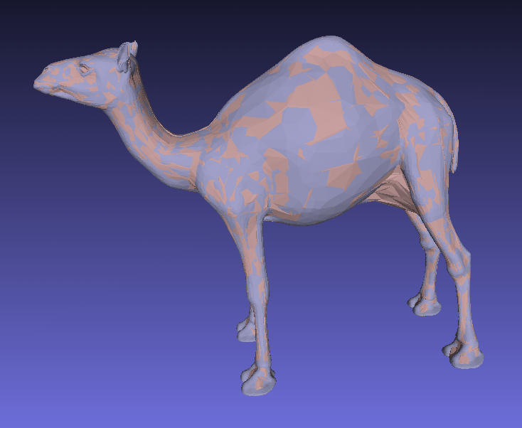

DeformationTransfer
===================

A very simple implement for the first step of deformation transfer that might be
<<<<<<< HEAD
used in my later reconstruction work. The result can be shown in

=======
used in my later reconstruction work. The result can be shown below.

>>>>>>> cf1e54c631d22d9f717cde3ce1b99a80c4b20d6c

NOET:
-------------------
This implement is so simple that the input data must be finely registered and
scaled to the same scale. And it does not contain a pair corresponding vertex
selection UI.

It depends on external libraries : **Eigen**[^1], **FLANN**[^2]

REMEMBER:
---------------------
The MACRO defined in .cc or .cpp file should be adjust to your input data and in
order to make the correspondence to be fine, you should add a boundary detect
function so to ignore the bad correspondence.

[^1]: [http://eigen.tuxfamily.org](http://eigen.tuxfamily.org)
[^2]: [FLANN](http://www.cs.ubc.ca/~mariusm/index.php/FLANN/FLANN)
